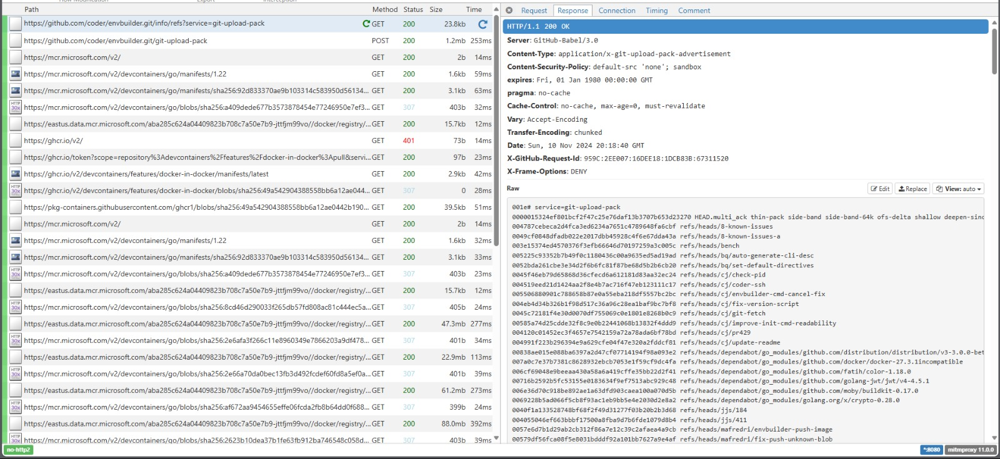

# How to run Envbuilder from behind a proxy

Envbuilder can be used from behind transparent TLS proxies that would normally risk interrupting TLS verification.

A summary of how to configure Envbuilder to run behind an HTTPS proxy is provided in the next session. Thereafter an illustrative example is provided that can be followed to prove the concept from first principles before applying it in production.

## Summary
To use Envbuilder behind a proxy that requires a custom certificate, the following configuration needs to be applied. Note that if you are using Envbuilder in conjunction with Coder, these variables should be set on the envbuilder container itself, not on the Coder agent.

To configure Envbuilder to route HTTP traffic for git and the container registry to the proxy do at least one of the following:
* Set the `https_proxy=https://host:port` environment variable for the envbuilder container. This will also proxy traffic for other programs in the container that respect `https_proxy`. If you do set it, look into the related `http_proxy` and `no_proxy` environment variables.
* Set the `ENVBUILDER_GIT_HTTP_PROXY_URL=https://host:port` environment variable. This will specifically route traffic for Envbuilder's git and container registry without affecting other programs inside the container.

Once traffic is routed to the proxy, you will need to install the proxy's CA certificate into Envbuilder. To do this, you can do one of the following:
* Set `ENVBUILDER_SSL_CERT_BASE64=...` for Envbuilder to the base64 encoded value of your proxy's CA certificate. This will only apply to Envbuilder. Other TLS connections within your container will not be aware of this certificate.
* Mount the certificate file into the Envbuilder container and then set `ENVBUILDER_SSL_CERT_FILE=/path/to/cert.pem`.
* Mount a directory containing all relevant CA certificates into the Envbuilder container and then set `ENVBUILDER_SSL_CERT_DIR=/path/to/certs/`.

## Demonstration
Envbuilder clones a repository that contains your devcontainer.json and optional Dockerfile so that it can build your container. If the clone is done using HTTPS, then TLS verification will have to succeed, or be disabled. If a transparent HTTPS proxy is present, TLS verification will fail unless Envbuilder trusts the certificate used by the transparent proxy. Therefore, we need to tell Envbuilder how to trust your transparent proxy. 

The summary in the previous section shows how to configure Envbuilder using Terraform for Docker and Kubernetes. For this example we'll use docker directly to avoid complexity that might result in confusion. Docker is also more likely than Terraform to already be installed in your testing environment.

Before we introduce an HTTPS proxy, let's prove that envbuilder runs normally. Run the following docker command to obtain a shell within an Envbuilder built environment:
```bash
docker run -it --rm \
    -e ENVBUILDER_INIT_SCRIPT='/bin/sh' \
    -e ENVBUILDER_GIT_URL='https://github.com/coder/envbuilder.git' \
    ghcr.io/coder/envbuilder:latest
```

Notice the log lines:
```
#1: 📦 Cloning https://github.com/coder/envbuilder.git to /workspaces/envbuilder...`
...
#1: 📦 Cloned repository! [711.221369ms]
```

After some time building, a shell will be presented inside the devcontainer environment specified in envbuilder's own repository. Assuming that envbuilder built and ran successfully, go ahead and exit the container:
```bash
exit
```

Let's now temporarily break Envbuilder by introducing a transparent TLS intercepting proxy. To do this, we'll use [mitmproxy](https://mitmproxy.org/). Start mitmproxy in a container, by running the following:
```bash
docker run --rm -d --user $(id -u):$(id -g) --name mitmproxy -v ./certs:/home/mitmproxy/.mitmproxy -p 8080:8080 -p 127.0.0.1:8081:8081 mitmproxy/mitmproxy mitmweb --web-host 0.0.0.0 --set http2=false
```

Notice that we disable HTTP2 on mitmproxy. This is because Envbuilder and mitmproxy do not seem to be able to negotiate which version of HTTP to use. mitmproxy seems to interpret Envbuilder's HTTP1.1 request as an HTTP2 request and then fails to find the expected HTTP2 preamble (because there is no HTTP2 preamble in an HTTP1.1 request). If your production proxy exhibits this behavior, please file a GitHub issue.

Confirm that mitmproxy is running and determine its IP address:
```bash
docker inspect mitmproxy | jq -r '.[].NetworkSettings.IPAddress'
```
yields:
```
172.17.0.2
```

You may see a different IP address. If you do, use that wherever we use `172.17.0.2` below. 

A new directory called certs should also be present in your current working directory. It will contain a CA certificate called  `mitmproxy-ca-cert.pem`. This will be what we provide to Envbuilder to help it trust our proxy.

Optionally, inspect the certificates served by mitmproxy:
```bash
openssl s_client -proxy localhost:8080 -servername github.com -connect github.com:443 | head -n 10
```
In the output, notice that we are served a certificate that is ostensibly for github.com. However, its issuer common name is "mitmproxy" and s_client couldn't verify the certificate:
```
depth=0 CN = github.com
verify error:num=20:unable to get local issuer certificate
verify return:1
depth=0 CN = github.com
verify error:num=21:unable to verify the first certificate
verify return:1
depth=0 CN = github.com
verify return:1
CONNECTED(00000003)
---
Certificate chain
 0 s:CN = github.com
   i:CN = mitmproxy, O = mitmproxy
   a:PKEY: rsaEncryption, 2048 (bit); sigalg: RSA-SHA256
   v:NotBefore: Nov  7 15:43:48 2024 GMT; NotAfter: Nov  9 15:43:48 2025 GMT
---
Server certificate
-----BEGIN CERTIFICATE-----
```

Let's rerun Envbuilder using the proxy to see how it responds. To do this, we use the same command as before, except that we also set the `https_proxy` environment variable:
```bash
docker run -it --rm \
    -e https_proxy=https://172.17.0.2:8080 \
    -e ENVBUILDER_INIT_SCRIPT='/bin/sh' \
    -e ENVBUILDER_GIT_URL='https://github.com/coder/envbuilder.git' \
    ghcr.io/coder/envbuilder:latest
```
From the logs, notice that certificate verification fails. It fails because it doesn't trust the certificate that was provided by mitmproxy:
```
Failed to clone repository: clone "https://github.com/coder/envbuilder.git": Get "https://github.com/coder/envbuilder.git/info/refs?service=git-upload-pack": proxyconnect tcp: tls: failed to verify certificate: x509: certificate signed by unknown authority
```

To fix this, we need to provide a ca certificate that Envbuilder can use to verify the server certificate that mitmproxy serves instead of github's actual certificate. Envbuilder provides a few environment variables to accomplish this. They are documented in the summary section above. For this example, we have the ca certificate saved in a directory. The easiest way to provide the ca certificate to envbuilder is therefore to mount it as a volume in the envbuilder container and tell envbuilder to use it. For this, we can use the `SSL_CERT_FILE` environment variable. The command to run Envbuilder is now:
```bash
docker run -it --rm \
    -v $PWD/certs:/certs \
    -e SSL_CERT_FILE=/certs/mitmproxy-ca-cert.pem \
    -e https_proxy=https://172.17.0.2:8080 \
    -e ENVBUILDER_INIT_SCRIPT='/bin/sh' \
    -e ENVBUILDER_GIT_URL='https://github.com/coder/envbuilder.git' \
    ghcr.io/coder/envbuilder:latest
```

As before, this command should yield a shell inside an Envbuilder built environment. Feel free to test it en then exit the container. Assuming this worked, Envbuilder will have cloned a repository and built the relevant container using a proxy that required a custom ca certificate.

### Bonus
To prove that Envbuilder did in fact use the proxy, and also because it is interesting to observe, open `http://localhost:8081/` in your local browser and you should see the mitmproxy web interface. In the flow tab, there should be a list of all of the HTTP requests that were required to build the container. The first three will be the requests that were used by git to clone the repository. The rest will be the requests that were used to clone the devcontainer image.



### Cleanup
Once the demonstration has concluded, cleanup the artifacts that were used in the process:
```bash
docker stop mitmproxy
rm -r certs/
```

You may require 